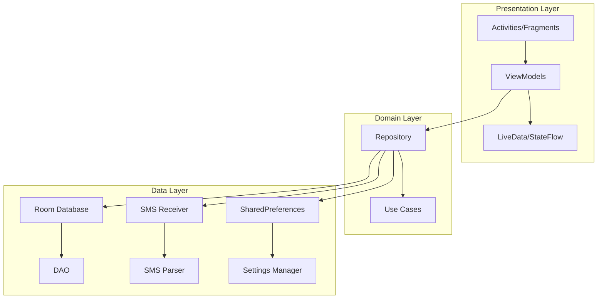

# Design Document

## Overview

The Android Expense Tracker is a native Android application built using Kotlin and following MVVM (Model-View-ViewModel) architecture. The app automatically captures UPI transactions from Axis Bank SMS messages and provides manual entry capabilities with a focus on transaction labeling and categorization. The design emphasizes clean, modern UI with smooth animations and efficient data management.

## Architecture

### MVVM Architecture Pattern



### Core Components

1. **Presentation Layer**: Activities, Fragments, ViewModels managing UI state
2. **Domain Layer**: Repository pattern for data abstraction and business logic
3. **Data Layer**: Room database, SMS processing, and local storage

## Components and Interfaces

### Database Layer

#### TransactionEntity
```kotlin
@Entity(tableName = "transactions")
data class TransactionEntity(
    @PrimaryKey(autoGenerate = true)
    val id: Long = 0,
    val amount: Double,
    val transactionType: String, // "DEBIT" or "CREDIT"
    val accountNumber: String = "XX3248",
    val transactionDate: String, // YYYY-MM-DD format
    val transactionTime: String, // HH:MM:SS format
    val receiverSenderName: String,
    val upiReference: String?,
    val bankName: String = "Axis Bank",
    val userTag: String?,
    val isTagged: Boolean = false,
    val entryMethod: String, // "SMS" or "MANUAL"
    val rawSmsText: String?,
    val createdAt: Long = System.currentTimeMillis()
)
```

#### TransactionDao
```kotlin
@Dao
interface TransactionDao {
    @Query("SELECT * FROM transactions WHERE DATE(transactionDate) = DATE('now', 'localtime') ORDER BY transactionTime DESC")
    fun getTodayTransactions(): Flow<List<TransactionEntity>>
    
    @Query("SELECT * FROM transactions WHERE isTagged = 0 ORDER BY transactionDate DESC, transactionTime DESC")
    fun getUntaggedTransactions(): Flow<List<TransactionEntity>>
    
    @Query("SELECT * FROM transactions ORDER BY transactionDate DESC, transactionTime DESC")
    fun getAllTransactions(): Flow<List<TransactionEntity>>
    
    @Query("SELECT * FROM transactions WHERE receiverSenderName LIKE '%' || :query || '%' OR userTag LIKE '%' || :query || '%'")
    fun searchTransactions(query: String): Flow<List<TransactionEntity>>
    
    @Insert
    suspend fun insertTransaction(transaction: TransactionEntity): Long
    
    @Update
    suspend fun updateTransaction(transaction: TransactionEntity)
    
    @Query("UPDATE transactions SET userTag = :tag, isTagged = :isTagged WHERE id = :id")
    suspend fun updateTransactionTag(id: Long, tag: String?, isTagged: Boolean)
}
```

#### TransactionDatabase
```kotlin
@Database(
    entities = [TransactionEntity::class],
    version = 1,
    exportSchema = false
)
@TypeConverters(Converters::class)
abstract class TransactionDatabase : RoomDatabase() {
    abstract fun transactionDao(): TransactionDao
    
    companion object {
        @Volatile
        private var INSTANCE: TransactionDatabase? = null
        
        fun getDatabase(context: Context): TransactionDatabase {
            return INSTANCE ?: synchronized(this) {
                val instance = Room.databaseBuilder(
                    context.applicationContext,
                    TransactionDatabase::class.java,
                    "transaction_database"
                ).build()
                INSTANCE = instance
                instance
            }
        }
    }
}
```

### SMS Processing Layer

#### SmsParser
```kotlin
class SmsParser {
    companion object {
        private val AMOUNT_REGEX = Regex("INR\\s+([\\d,]+\\.?\\d{0,2})")
        private val TRANSACTION_TYPE_REGEX = Regex("(debited|credited)")
        private val ACCOUNT_REGEX = Regex("A/c no\\.\\s+(\\w+)")
        private val DATE_TIME_REGEX = Regex("(\\d{2}-\\d{2}-\\d{2}),\\s+(\\d{2}:\\d{2}:\\d{2})")
        private val UPI_NAME_REGEX = Regex("UPI/P2[MA]/\\d+/([^/\\n]+)")
        private val UPI_REFERENCE_REGEX = Regex("(UPI/P2[MA]/\\d+/[^\\n]+)")
    }
    
    fun parseTransaction(smsBody: String): ParsedTransaction? {
        // Implementation for parsing SMS content
        // Returns ParsedTransaction object or null if parsing fails
    }
}

data class ParsedTransaction(
    val amount: Double,
    val transactionType: String,
    val accountNumber: String,
    val date: String,
    val time: String,
    val receiverSenderName: String,
    val upiReference: String?,
    val rawSmsText: String
)
```

#### TransactionSmsReceiver
```kotlin
class TransactionSmsReceiver : BroadcastReceiver() {
    override fun onReceive(context: Context, intent: Intent) {
        if (intent.action == Telephony.Sms.Intents.SMS_RECEIVED_ACTION) {
            val messages = Telephony.Sms.Intents.getMessagesFromIntent(intent)
            
            for (message in messages) {
                val sender = message.displayOriginatingAddress
                val body = message.messageBody
                
                if (sender.matches(Regex("^[A-Z]{2}-AXISBK-S$"))) {
                    processAxisBankSms(context, body, sender)
                }
            }
        }
    }
    
    private fun processAxisBankSms(context: Context, smsBody: String, sender: String) {
        // Parse SMS and save to database
        // Show notification
    }
}
```

### Repository Layer

#### TransactionRepository
```kotlin
class TransactionRepository(
    private val transactionDao: TransactionDao,
    private val smsParser: SmsParser
) {
    fun getTodayTransactions(): Flow<List<Transaction>> = 
        transactionDao.getTodayTransactions().map { entities ->
            entities.map { it.toTransaction() }
        }
    
    fun getUntaggedTransactions(): Flow<List<Transaction>> = 
        transactionDao.getUntaggedTransactions().map { entities ->
            entities.map { it.toTransaction() }
        }
    
    fun getAllTransactions(): Flow<List<Transaction>> = 
        transactionDao.getAllTransactions().map { entities ->
            entities.map { it.toTransaction() }
        }
    
    suspend fun insertTransaction(transaction: Transaction): Long {
        return transactionDao.insertTransaction(transaction.toEntity())
    }
    
    suspend fun updateTransactionTag(transactionId: Long, tag: String?) {
        transactionDao.updateTransactionTag(transactionId, tag, !tag.isNullOrBlank())
    }
    
    suspend fun processSmsTransaction(smsBody: String): Transaction? {
        val parsed = smsParser.parseTransaction(smsBody) ?: return null
        val transaction = parsed.toTransaction()
        val id = insertTransaction(transaction)
        return transaction.copy(id = id)
    }
}
```

### UI Layer Components

#### HomeViewModel
```kotlin
class HomeViewModel(
    private val repository: TransactionRepository,
    private val settingsManager: SettingsManager
) : ViewModel() {
    
    private val _todayTransactions = MutableLiveData<List<Transaction>>()
    val todayTransactions: LiveData<List<Transaction>> = _todayTransactions
    
    private val _timeFormat = MutableLiveData<TimeFormat>()
    val timeFormat: LiveData<TimeFormat> = _timeFormat
    
    init {
        loadTodayTransactions()
        loadTimeFormat()
    }
    
    private fun loadTodayTransactions() {
        viewModelScope.launch {
            repository.getTodayTransactions().collect {
                _todayTransactions.value = it
            }
        }
    }
    
    fun toggleTimeFormat() {
        val newFormat = if (_timeFormat.value == TimeFormat.TWENTY_FOUR_HOUR) {
            TimeFormat.TWELVE_HOUR
        } else {
            TimeFormat.TWENTY_FOUR_HOUR
        }
        settingsManager.setTimeFormat(newFormat)
        _timeFormat.value = newFormat
    }
}
```

#### TransactionAdapter
```kotlin
class TransactionAdapter(
    private val onTransactionClick: (Transaction) -> Unit
) : ListAdapter<Transaction, TransactionViewHolder>(TransactionDiffCallback()) {
    
    override fun onCreateViewHolder(parent: ViewGroup, viewType: Int): TransactionViewHolder {
        val binding = ItemTransactionBinding.inflate(
            LayoutInflater.from(parent.context), parent, false
        )
        return TransactionViewHolder(binding, onTransactionClick)
    }
    
    override fun onBindViewHolder(holder: TransactionViewHolder, position: Int) {
        holder.bind(getItem(position))
    }
}

class TransactionViewHolder(
    private val binding: ItemTransactionBinding,
    private val onTransactionClick: (Transaction) -> Unit
) : RecyclerView.ViewHolder(binding.root) {
    
    fun bind(transaction: Transaction) {
        binding.apply {
            // Set transaction data with appropriate colors and animations
            // Handle click events
        }
    }
}
```

## Data Models

### Core Transaction Model
```kotlin
data class Transaction(
    val id: Long = 0,
    val amount: Double,
    val transactionType: TransactionType,
    val accountNumber: String,
    val transactionDate: LocalDate,
    val transactionTime: LocalTime,
    val receiverSenderName: String,
    val upiReference: String?,
    val bankName: String,
    val userTag: String?,
    val isTagged: Boolean,
    val entryMethod: EntryMethod,
    val rawSmsText: String?,
    val createdAt: Long
)

enum class TransactionType {
    DEBIT, CREDIT
}

enum class EntryMethod {
    SMS, MANUAL
}

enum class TimeFormat {
    TWELVE_HOUR, TWENTY_FOUR_HOUR
}
```

### UI State Models
```kotlin
data class HomeUiState(
    val transactions: List<Transaction> = emptyList(),
    val isLoading: Boolean = false,
    val error: String? = null,
    val timeFormat: TimeFormat = TimeFormat.TWENTY_FOUR_HOUR
)

data class TransactionDetailUiState(
    val transaction: Transaction? = null,
    val isLoading: Boolean = false,
    val isSaving: Boolean = false,
    val error: String? = null,
    val saveSuccess: Boolean = false
)
```

## Error Handling

### SMS Parsing Error Handling
- Invalid SMS format: Log error, ignore SMS
- Missing required fields: Log warning, attempt partial parsing
- Database insertion failure: Retry mechanism with exponential backoff
- Permission denied: Show user-friendly permission request dialog

### Database Error Handling
- Database corruption: Implement database migration and recovery
- Transaction conflicts: Use database transactions with proper isolation
- Storage full: Show user notification with cleanup suggestions

### UI Error Handling
- Network unavailable: Show offline mode indicator
- Permission denied: Show permission rationale and request
- Invalid user input: Show inline validation errors
- App crashes: Implement crash reporting and graceful recovery

## Testing Strategy

### Unit Testing
- SMS parsing logic with various message formats
- Database operations and data transformations
- ViewModel business logic and state management
- Repository pattern implementation

### Integration Testing
- SMS receiver with database integration
- End-to-end transaction flow from SMS to UI
- Permission handling across different Android versions

### UI Testing
- Screen navigation and user interactions
- Animation performance and smoothness
- Accessibility compliance testing

## Performance Considerations

### Database Optimization
- Proper indexing on frequently queried columns (date, isTagged)
- Pagination for large transaction lists
- Background thread operations for all database access

### Memory Management
- Efficient RecyclerView with ViewHolder pattern
- Image and animation resource optimization
- Proper lifecycle management for ViewModels

### Battery Optimization
- Efficient SMS receiver implementation
- Minimal background processing
- Proper use of JobScheduler for background tasks

## Security and Privacy

### Data Protection
- All data stored locally in encrypted SQLite database
- No network communication or data transmission
- Secure handling of sensitive SMS content

### Permission Management
- Runtime permission requests with clear explanations
- Graceful degradation when permissions are denied
- Minimal permission scope (only SMS and notifications)

### Privacy Compliance
- No user tracking or analytics
- Clear privacy policy explaining data usage
- User control over data deletion and export